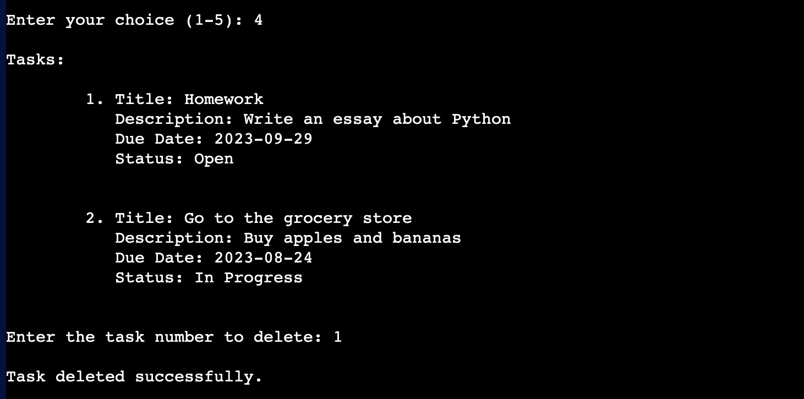
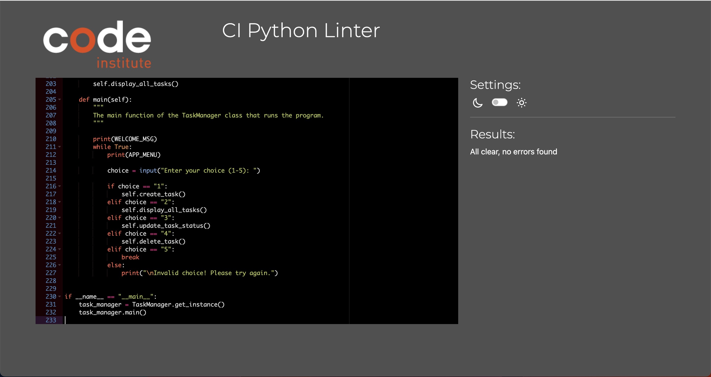

[Click here](https://daily-task-manager-a1eb82a65d82.herokuapp.com/) to use the app.

# DAILY - The Task Manager.

DAILY is a valuable tool for people looking to stay organized and maximize their productivity. With its user-friendly interface and intuitive features, it empowers users to take control of their tasks and optimize their workflow.

## Project Scope

For my third portfolio project at [Code Institue's](https://codeinstitute.net/) Fullstack Software Development Program, I was tasked with developing a terminal application in Python. Given the opportunity to create a program with real-world utility, I decided to develop a Task Manager.

## User Stories

Defining user stories before building an app helps prioritize user needs, communicate effectively, plan development and validate functionality. It ensures a user-centric and successful app development process.

- As a user, I want to be able to create new tasks.
- As a user, I want to be able to view a list of all my tasks to get an overview of my tasks.
- As a user, I want to be able to update the status between Open, in Progress and Completed.
- As a user, I want to be able to delete tasks that are completed or no longer relevant.
- As a user, I want to be able to exit the program when I have finished working.
- As a user, I want to be able to specify the date I want my task to be finished.
- As a user, I want to receive an error message when entering invalid data.

## Flowchart

Creating a flowchart before programming helped me visualize the app's logic, plan efficiently and optimize user experience. 

## Features

In the following section, I will introduce the features of the application and explain how to use it.

### Menu

The menu comprises a welcome message, a brief application description, and the 5 options from which the user can choose. The user is prompted to make a selection by entering the corresponding number.

### Create A New Task

When choosing the "Create a new task" option, you will be asked to enter a title for the task. Press Enter to confirm your input. Next, you will be prompted to provide a brief description of the task. Finally, you will be asked to enter the due date for the task. Please ensure that you enter the date in the correct format, and then press Enter to create and save the task.

### Display Your Tasks

If you choose the "Display Your Tasks" option, the program will check if you have any existing tasks. If tasks are found, they will be listed for you.

### Update A Task Status

If you select the "Update A Task Status" option, you will be presented with your existing tasks. You can then choose which task's status you want to modify. Once you have made your selection, you will be prompted to choose between changing the status to "Open," "In Progress," or "Completed." You can use a shortcut to make this selection, and the status will be updated accordingly.

### Delete a Task

When selecting the "Delete A Task" option, the program will verify if there are any tasks available. If tasks exist, they will be shown to you, and you will be asked to enter the number of the task you want to delete. Once you provide a valid number, the program will delete the corresponding task, and you will receive a confirmation message indicating the successful deletion.

## Testing

### Manual Testing

I confirm that I tested all features and all of the worked wihout any problems. In order to ensure that the program does not crash due to incorrect user input during interaction, error handling has been implemented. This error handling was manually tested afterwards, and the results were documented in a table.

|                  Point of time                    |    Input   |                          Output                      |
|---------------------------------------------------|------------|------------------------------------------------------|
|            "Enter your choice (1-5): "            |      6     |            "Invalid choice! Please try again."       |
|            "Enter your choice (1-5): "            |      N     |            "Invalid choice! Please try again."       |
|            "Enter your choice (1-5): "            |      2     |           "Sorry, you don't have any tasks yet."     |
|            "Enter your choice (1-5): "            |      3     | "Sorry, no tasks found. There is nothing to update." |
|            "Enter your choice (1-5): "            |      4     |         "Sorry, you don't have any tasks yet."       |
|              "Enter a task title: "               |    Enter   |   "I'm sorry! You need to give your task a title."   |
| "When has the task to be finished (DD-MM-YYYY): " | 2023-09-23 |      "Invalid date format. Task creation failed."    |
|       "Enter task number to change status: "      |      X     |           "Sorry, you didn't enter a number."        |
|       "Enter task number to delete: "             |      p     |  "Sorry, invalid task number. Task deletion failed.  |
|        "Please choose (O / P / C): "              |      9     |   "Invalid task status. Task status update failed."  |

### Validator Testing

I passed the run.py file through a PEP8 Linter and confirm no errors were found.

## Tools & Technologies

- The application was written in [Python Programming Language](https://www.python.org/)
- In order to run the application on the web, Code Institute's [Command Line Application Template](https://github.com/codewithmaik/command-line-template) was used.
- The application was deployed using [Heroku](https://www.heroku.com/platform)
- [Codeanywhere](https://codeanywhere.com/) was used as the cloud IDE
- [Git](https://git-scm.com/) and [Github](https://github.com/) were used for version control.
- [Am I responsive](https://ui.dev/amiresponsive) was used for the application picture.
- [Lucidchart](https://www.lucidchart.com) was used to build the flowchart.

## Deployment

Steps to deploy the application using Heroku:

- Log in to your Heroku account
- Create a new Heroku application
- Set buildpacks to Python and NodeJS
- Link the Heroku App to the repository
- Click on Deploy
