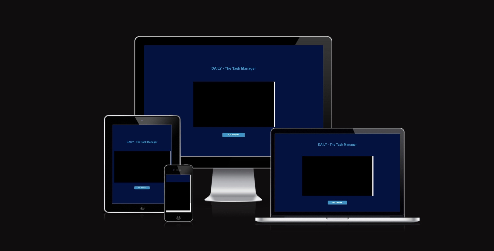
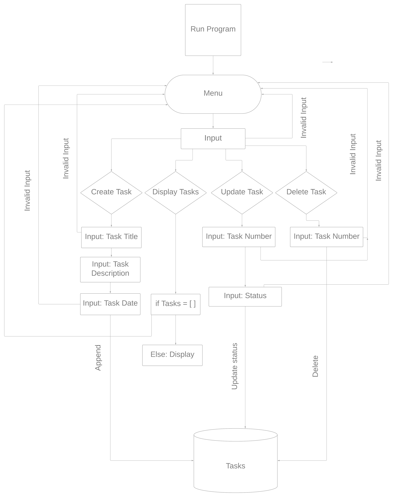
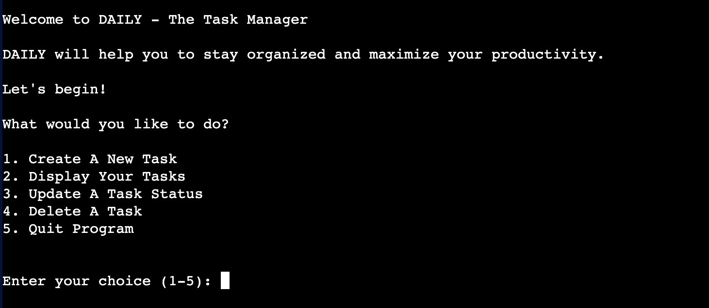
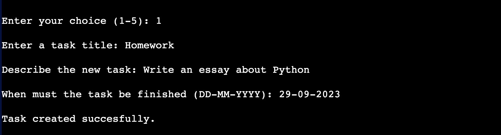
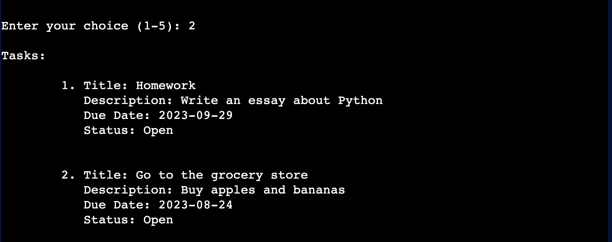
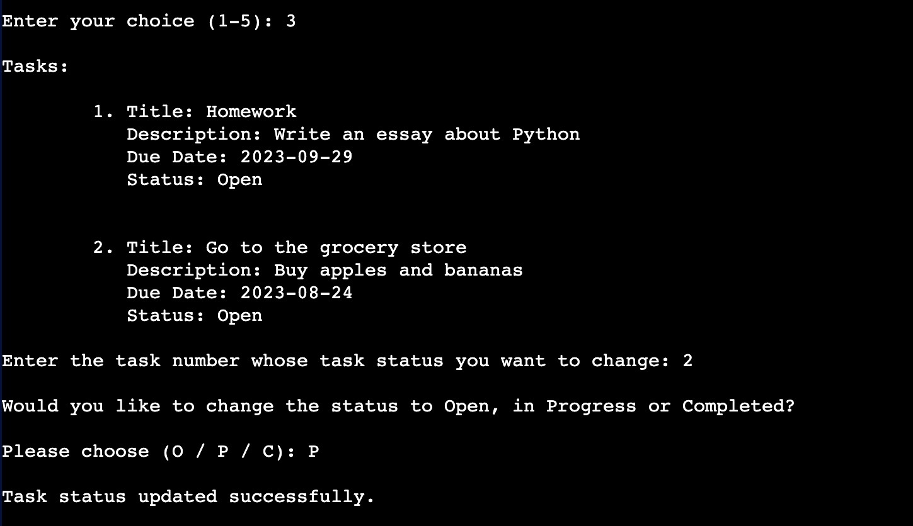

[Click here](https://daily-task-manager-a1eb82a65d82.herokuapp.com/) to use the app.

# DAILY - The Task Manager.

DAILY is a valuable tool for people looking to stay organized and maximize their productivity. With its user-friendly interface and intuitive features, it empowers users to take control of their tasks and optimize their workflow.

## Project Scope

For my third portfolio project at [Code Institue's](https://codeinstitute.net/) Fullstack Software Development Program, I was tasked with developing a terminal application in Python. Given the opportunity to create a program with real-world utility, I decided to develop a Task Manager.

## User Stories

- As a user, I want to be able to create new tasks.
- As a user, I want to be able to view a list of all my tasks to get an overview of my tasks.
- As a user, I want to be able to update the status between Open, in Progress and Completed.
- As a user, I want to be able to delete tasks that are completed or no longer relevant.
- As a user, I want to be able to exit the program when I have finished working.
- As a user, I want to be able to specify the date I want my task to be finished.
- As a user, I want to receive an error message when entering invalid data.

## Flowchart

## Features

### Menu

After starting the program, you are greeted with the main menu, where you receive a warm welcome and a brief introduction to the app's features. The menu presents several options, and you must make a selection by entering the corresponding number and pressing Enter.

### Create A New Task

When choosing the "Create a new task" option, you will be asked to enter a title for the task. Press Enter to confirm your input. Next, you will be prompted to provide a brief description of the task. Finally, you will be asked to enter the due date for the task. Please ensure that you enter the date in the correct format, and then press Enter to create and save the task.

### Display Your Tasks

If you choose the "Display Your Tasks" option, the program will check if you have any existing tasks. If tasks are found, they will be listed for you.

### Update A Task Status

If you select the "Update A Task Status" option, you will be presented with your existing tasks. You can then choose which task's status you want to modify. Once you have made your selection, you will be prompted to choose between changing the status to "Open," "In Progress," or "Completed." You can use a shortcut to make this selection, and the status will be updated accordingly.